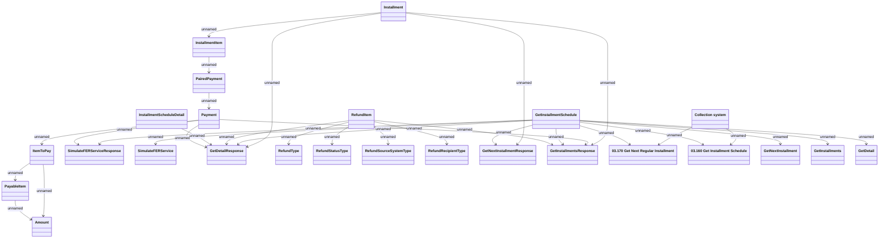

# installmentSchedule

```mermaid
classDiagram
    class ItemToPay["ItemToPay"]
    class Amount["Amount"]
    class PayableItem["PayableItem"]
    class Payment["Payment"]
    class SimulateFERServiceResponse["SimulateFERServiceResponse"]
    class SimulateFERService["SimulateFERService"]
    class InstallmentScheduleDetail["InstallmentScheduleDetail"]
    class GetDetailResponse["GetDetailResponse"]
    class Collection_system["Collection system"]
    class RefundType["RefundType"]
    class RefundStatusType["RefundStatusType"]
    class RefundSourceSystemType["RefundSourceSystemType"]
    class RefundRecipientType["RefundRecipientType"]
    class RefundItem["RefundItem"]
    class Payment["Payment"]
    class PairedPayment["PairedPayment"]
    class InstallmentItem["InstallmentItem"]
    class GetNextInstallmentResponse["GetNextInstallmentResponse"]
    class GetInstallmentsResponse["GetInstallmentsResponse"]
    class Installment["Installment"]
    class n_03_170_Get_Next_Regular_Installment["03.170 Get Next Regular Installment"]
    class n_03_160_Get_Installment_Schedule["03.160 Get Installment Schedule"]
    class GetNextInstallment["GetNextInstallment"]
    class GetInstallments["GetInstallments"]
    class GetDetail["GetDetail"]
    class GetInstallmentSchedule["GetInstallmentSchedule"]
    ItemToPay --> PayableItem : unnamed
    RefundItem --> RefundRecipientType : unnamed
    RefundItem --> RefundSourceSystemType : unnamed
    RefundItem --> RefundStatusType : unnamed
    RefundItem --> GetInstallmentsResponse : unnamed
    Payment --> GetDetailResponse : unnamed
    RefundItem --> RefundType : unnamed
    PairedPayment --> Payment : unnamed
    InstallmentScheduleDetail --> GetDetailResponse : unnamed
    Payment --> SimulateFERServiceResponse : unnamed
    Payment --> ItemToPay : unnamed
    PayableItem --> Amount : unnamed
    ItemToPay --> Amount : unnamed
    RefundItem --> GetDetailResponse : unnamed
    GetInstallmentSchedule --> GetDetailResponse : unnamed
    GetInstallmentSchedule --> GetInstallmentsResponse : unnamed
    GetInstallmentSchedule --> GetNextInstallment : unnamed
    GetInstallmentSchedule --> GetDetail : unnamed
    GetInstallmentSchedule --> n_03_170_Get_Next_Regular_Installment : unnamed
    GetInstallmentSchedule --> GetNextInstallmentResponse : unnamed
    Payment --> GetInstallmentsResponse : unnamed
    GetInstallmentSchedule --> n_03_160_Get_Installment_Schedule : unnamed
    GetInstallmentSchedule --> SimulateFERServiceResponse : unnamed
    GetInstallmentSchedule --> GetInstallments : unnamed
    Installment --> GetNextInstallmentResponse : unnamed
    Installment --> GetInstallmentsResponse : unnamed
    Installment --> GetDetailResponse : unnamed
    Installment --> InstallmentItem : unnamed
    InstallmentItem --> PairedPayment : unnamed
    GetInstallmentSchedule --> SimulateFERService : unnamed
    Collection_system --> n_03_170_Get_Next_Regular_Installment : unnamed
    Collection_system --> n_03_160_Get_Installment_Schedule : unnamed
```
