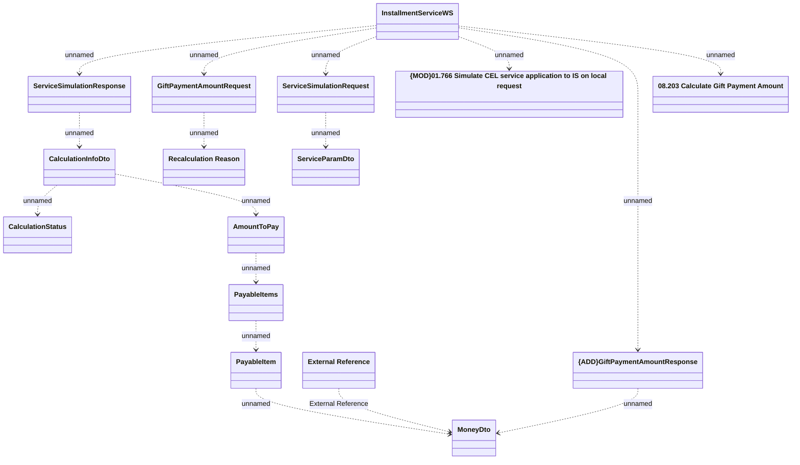

# InstallmentServiceWS

- **Diagram Type**: Logical
- **Package**: HomerSelect/BSL/Analysis Model/_Interface/Provided Web Services/Installment Schedule/InstallmentServiceWS
- **Diagram ID**: 117215
- **Elements**: 16
- **Connectors**: 16

