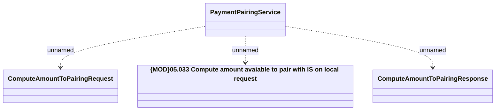

# PaymentPairingService - compute amount to pairing 

- **Diagram Type**: Logical
- **Package**: HomerSelect/BSL/Analysis Model/_Interface/Provided Web Services/Installment Schedule/PaymentPairingService
- **Diagram ID**: 92860
- **Elements**: 4
- **Connectors**: 3

