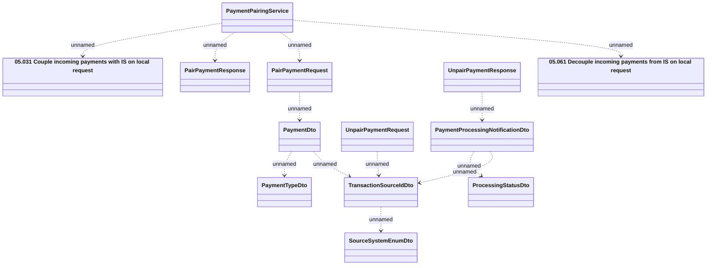

# PaymentPairingService - pair and unpari payment

- **Diagram Type**: Logical
- **Package**: HomerSelect/BSL/Analysis Model/_Interface/Provided Web Services/Installment Schedule/PaymentPairingService
- **Diagram ID**: 92859
- **Elements**: 13
- **Connectors**: 12

