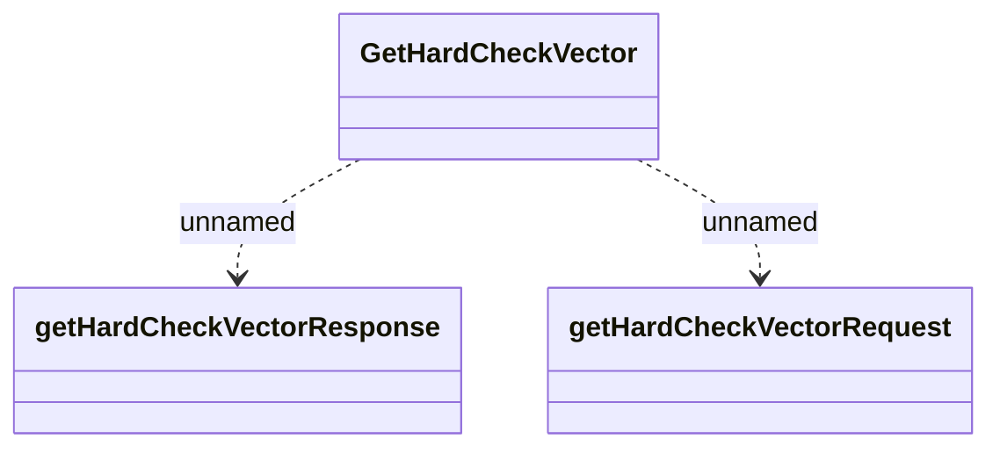

# GetHardCheckVector_v1

- **Diagram Type**: Logical
- **Package**: HomerSelect/BSL/Analysis Model/_Interface/Provided Web Services/Installment Schedule/Vector/Get hard check vector/v1
- **Diagram ID**: 157102
- **Elements**: 3
- **Connectors**: 2

