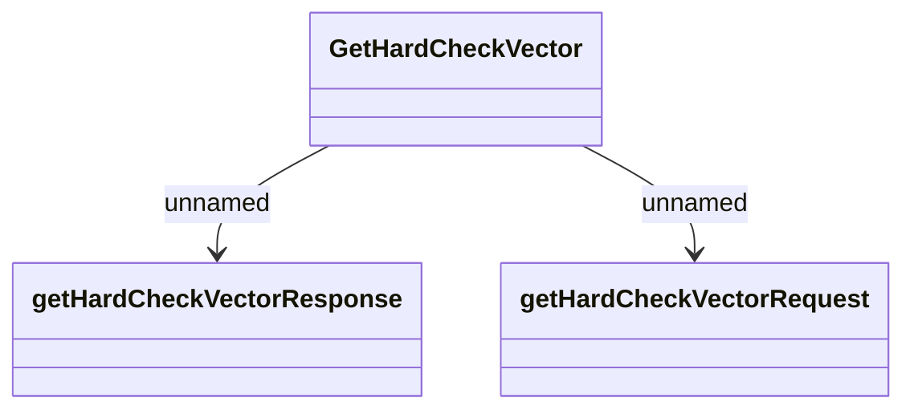

# GetHardCheckVector_v1

```mermaid
classDiagram
    class getHardCheckVectorResponse["getHardCheckVectorResponse"]
    class getHardCheckVectorRequest["getHardCheckVectorRequest"]
    class GetHardCheckVector["GetHardCheckVector"]
    GetHardCheckVector --> getHardCheckVectorResponse : unnamed
    GetHardCheckVector --> getHardCheckVectorRequest : unnamed
```
