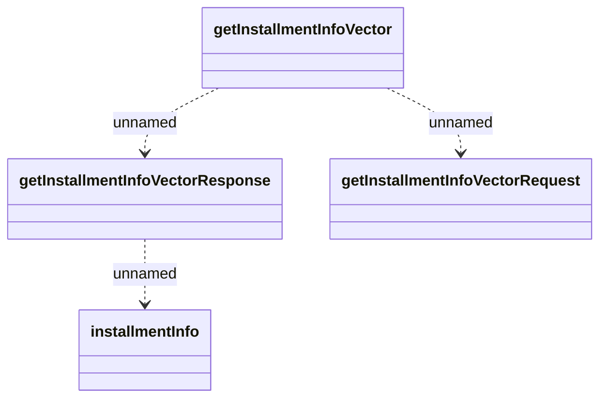

# GetInstallmentInfoVector_v1

- **Diagram Type**: Logical
- **Package**: HomerSelect/BSL/Analysis Model/_Interface/Provided Web Services/Installment Schedule/Vector/Get installments info vector/v1
- **Diagram ID**: 157140
- **Elements**: 4
- **Connectors**: 3

