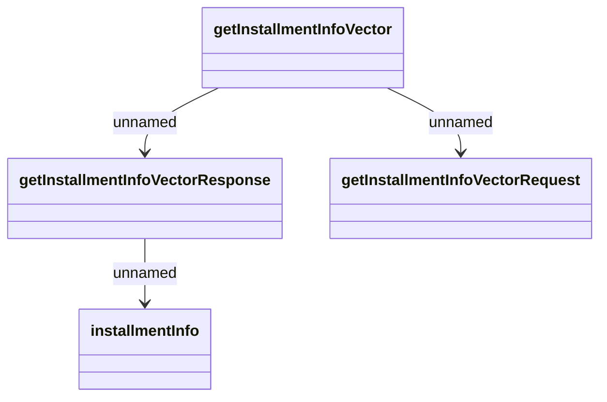

# GetInstallmentInfoVector_v1

```mermaid
classDiagram
    class getInstallmentInfoVectorResponse["getInstallmentInfoVectorResponse"]
    class installmentInfo["installmentInfo"]
    class getInstallmentInfoVectorRequest["getInstallmentInfoVectorRequest"]
    class getInstallmentInfoVector["getInstallmentInfoVector"]
    getInstallmentInfoVector --> getInstallmentInfoVectorResponse : unnamed
    getInstallmentInfoVectorResponse --> installmentInfo : unnamed
    getInstallmentInfoVector --> getInstallmentInfoVectorRequest : unnamed
```
