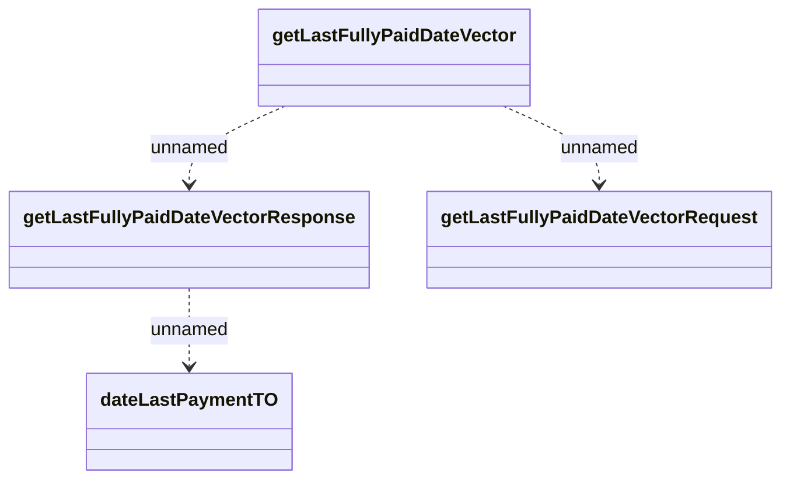

# GetLastFullyPaidDateVector_v1

- **Diagram Type**: Logical
- **Package**: HomerSelect/BSL/Analysis Model/_Interface/Provided Web Services/Installment Schedule/Vector/Get last fully paid date vector/v1
- **Diagram ID**: 157141
- **Elements**: 4
- **Connectors**: 3

