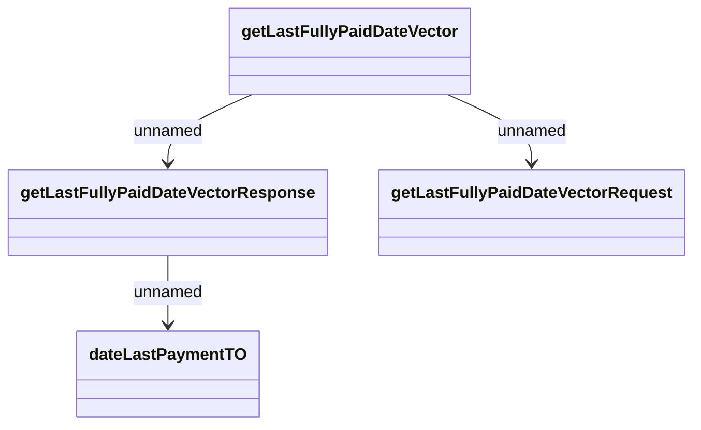

# GetLastFullyPaidDateVector_v1

```mermaid
classDiagram
    class dateLastPaymentTO["dateLastPaymentTO"]
    class getLastFullyPaidDateVectorResponse["getLastFullyPaidDateVectorResponse"]
    class getLastFullyPaidDateVectorRequest["getLastFullyPaidDateVectorRequest"]
    class getLastFullyPaidDateVector["getLastFullyPaidDateVector"]
    getLastFullyPaidDateVectorResponse --> dateLastPaymentTO : unnamed
    getLastFullyPaidDateVector --> getLastFullyPaidDateVectorResponse : unnamed
    getLastFullyPaidDateVector --> getLastFullyPaidDateVectorRequest : unnamed
```
