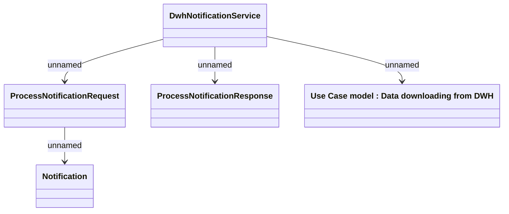

# DwhNotificationService

```mermaid
classDiagram
    class DwhNotificationService["DwhNotificationService"]
    class ProcessNotificationRequest["ProcessNotificationRequest"]
    class Notification["Notification"]
    class ProcessNotificationResponse["ProcessNotificationResponse"]
    class Use_Case_model_Data_downloading_from_DWH["Use Case model : Data downloading from DWH"]
    DwhNotificationService --> ProcessNotificationRequest : unnamed
    ProcessNotificationRequest --> Notification : unnamed
    DwhNotificationService --> ProcessNotificationResponse : unnamed
    DwhNotificationService --> Use_Case_model_Data_downloading_from_DWH : unnamed
```
