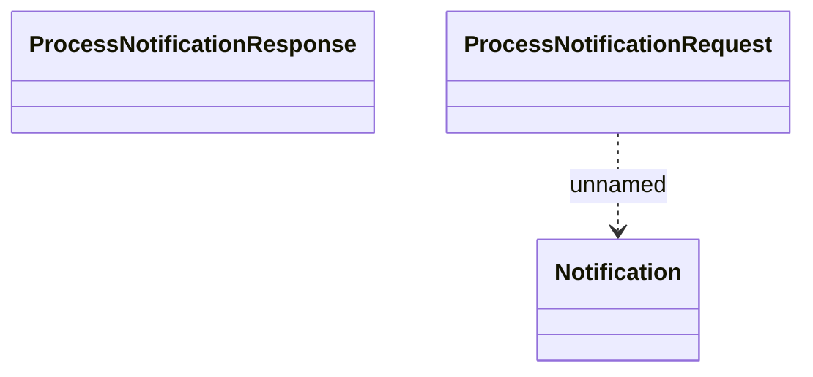

# Types

- **Diagram Type**: Logical
- **Package**: HomerSelect/BSL/Analysis Model/_Interface/Provided Web Services/Notifications/DwhNotificationService/Types
- **Diagram ID**: 46453
- **Elements**: 3
- **Connectors**: 1

