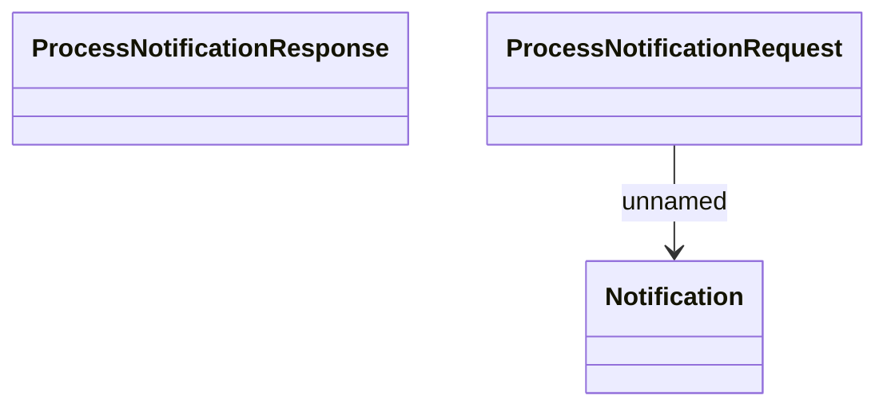

# Types

```mermaid
classDiagram
    class ProcessNotificationResponse["ProcessNotificationResponse"]
    class Notification["Notification"]
    class ProcessNotificationRequest["ProcessNotificationRequest"]
    ProcessNotificationRequest --> Notification : unnamed
```
