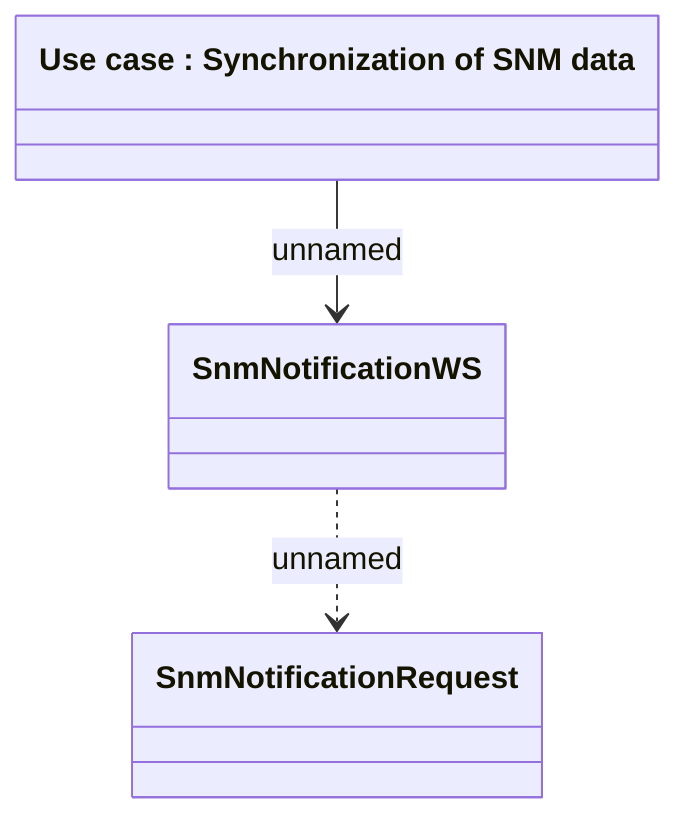

# SNMNotificationWS

- **Diagram Type**: Logical
- **Package**: HomerSelect/BSL/Analysis Model/_Interface/Provided Web Services/Notifications/SNMNotificationWS
- **Diagram ID**: 71678
- **Elements**: 3
- **Connectors**: 2

