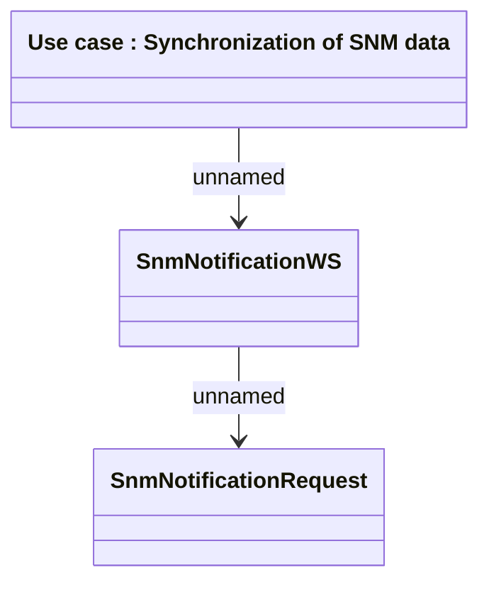

# SNMNotificationWS

```mermaid
classDiagram
    class SnmNotificationWS["SnmNotificationWS"]
    class SnmNotificationRequest["SnmNotificationRequest"]
    class Use_case_Synchronization_of_SNM_data["Use case : Synchronization of SNM data"]
    SnmNotificationWS --> SnmNotificationRequest : unnamed
    Use_case_Synchronization_of_SNM_data --> SnmNotificationWS : unnamed
```
