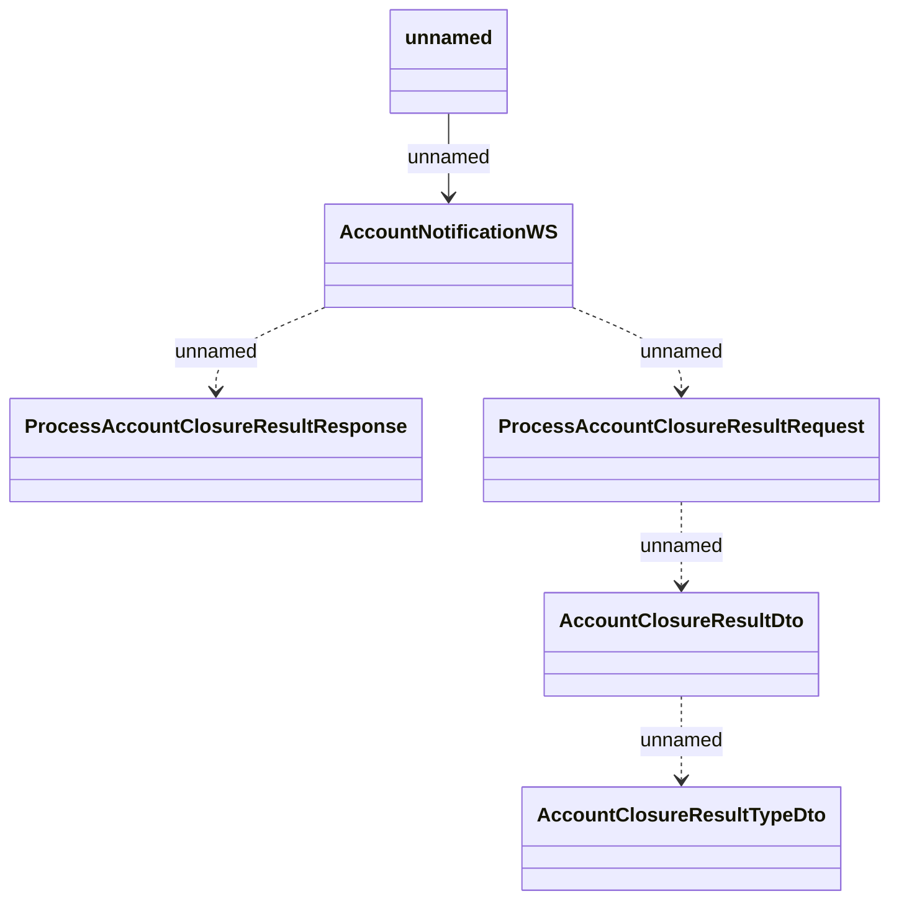

# AccountNotificationWS - Account closure

- **Diagram Type**: Logical
- **Package**: HomerSelect/BSL/Analysis Model/_Interface/Provided Web Services/Payment Card system/Account notifications
- **Diagram ID**: 107062
- **Elements**: 6
- **Connectors**: 5

