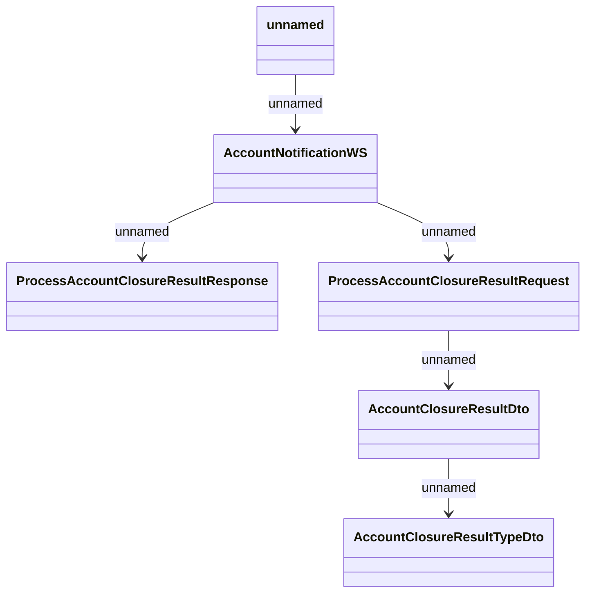

# AccountNotificationWS - Account closure

```mermaid
classDiagram
    class AccountClosureResultTypeDto["AccountClosureResultTypeDto"]
    class AccountClosureResultDto["AccountClosureResultDto"]
    class ProcessAccountClosureResultResponse["ProcessAccountClosureResultResponse"]
    class ProcessAccountClosureResultRequest["ProcessAccountClosureResultRequest"]
    class AccountNotificationWS["AccountNotificationWS"]
    unnamed --> AccountNotificationWS : unnamed
    AccountNotificationWS --> ProcessAccountClosureResultRequest : unnamed
    AccountNotificationWS --> ProcessAccountClosureResultResponse : unnamed
    ProcessAccountClosureResultRequest --> AccountClosureResultDto : unnamed
    AccountClosureResultDto --> AccountClosureResultTypeDto : unnamed
```
