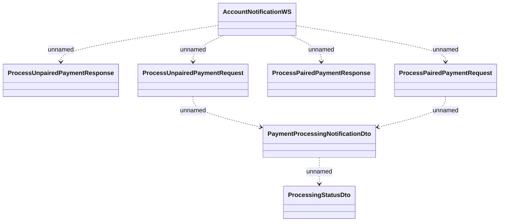

# AccountNotificationWS - Incoming payment processing

- **Diagram Type**: Logical
- **Package**: HomerSelect/BSL/Analysis Model/_Interface/Provided Web Services/Payment Card system/Account notifications
- **Diagram ID**: 107061
- **Elements**: 7
- **Connectors**: 7

