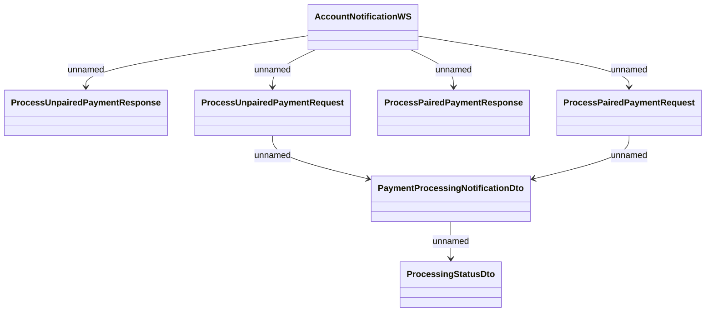

# AccountNotificationWS - Incoming payment processing

```mermaid
classDiagram
    class ProcessingStatusDto["ProcessingStatusDto"]
    class PaymentProcessingNotificationDto["PaymentProcessingNotificationDto"]
    class ProcessUnpairedPaymentResponse["ProcessUnpairedPaymentResponse"]
    class ProcessUnpairedPaymentRequest["ProcessUnpairedPaymentRequest"]
    class ProcessPairedPaymentResponse["ProcessPairedPaymentResponse"]
    class ProcessPairedPaymentRequest["ProcessPairedPaymentRequest"]
    class AccountNotificationWS["AccountNotificationWS"]
    AccountNotificationWS --> ProcessPairedPaymentRequest : unnamed
    AccountNotificationWS --> ProcessPairedPaymentResponse : unnamed
    AccountNotificationWS --> ProcessUnpairedPaymentRequest : unnamed
    AccountNotificationWS --> ProcessUnpairedPaymentResponse : unnamed
    ProcessUnpairedPaymentRequest --> PaymentProcessingNotificationDto : unnamed
    ProcessPairedPaymentRequest --> PaymentProcessingNotificationDto : unnamed
    PaymentProcessingNotificationDto --> ProcessingStatusDto : unnamed
```
