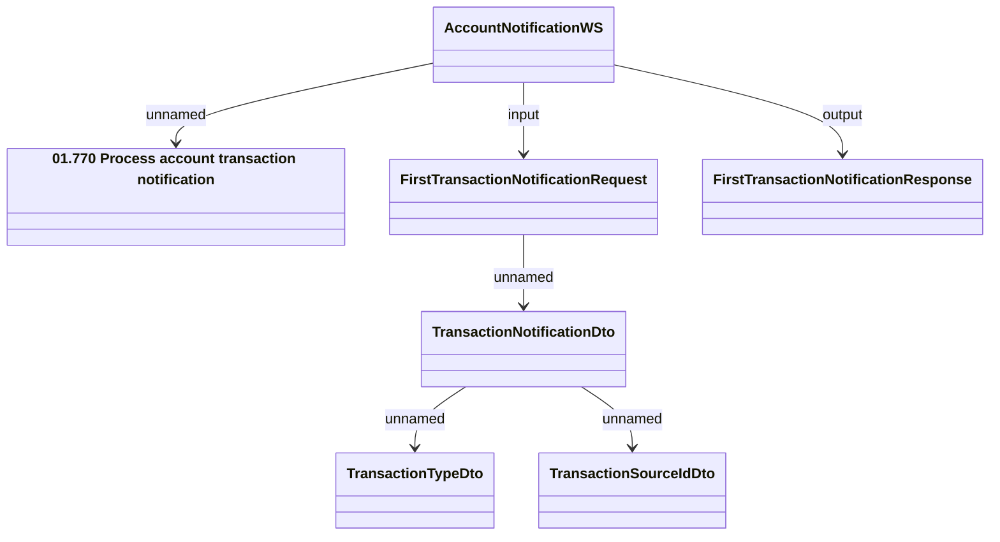

# AccountNotificationWS - Transactions

```mermaid
classDiagram
    class TransactionSourceIdDto["TransactionSourceIdDto"]
    class TransactionTypeDto["TransactionTypeDto"]
    class n_01_770_Process_account_transaction_notification["01.770 Process account transaction notification"]
    class AccountNotificationWS["AccountNotificationWS"]
    class FirstTransactionNotificationRequest["FirstTransactionNotificationRequest"]
    class FirstTransactionNotificationResponse["FirstTransactionNotificationResponse"]
    class TransactionNotificationDto["TransactionNotificationDto"]
    FirstTransactionNotificationRequest --> TransactionNotificationDto : unnamed
    AccountNotificationWS --> FirstTransactionNotificationResponse : output
    AccountNotificationWS --> FirstTransactionNotificationRequest : input
    AccountNotificationWS --> n_01_770_Process_account_transaction_notification : unnamed
    TransactionNotificationDto --> TransactionTypeDto : unnamed
    TransactionNotificationDto --> TransactionSourceIdDto : unnamed
```
