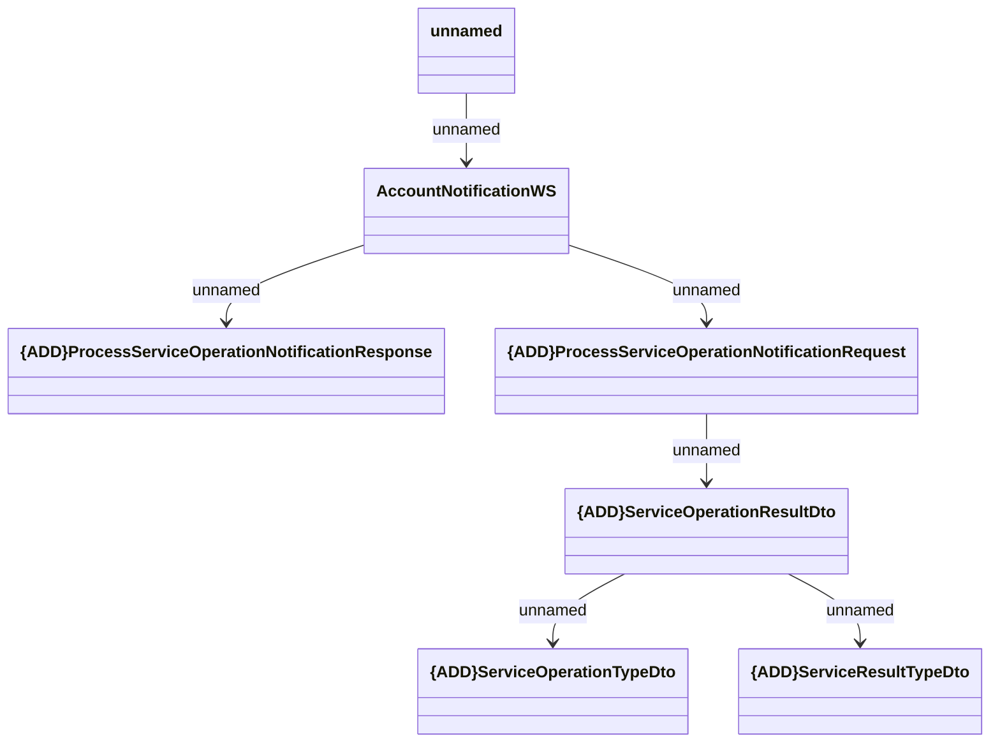

# AccountNotificationsWS - Service operation notification

```mermaid
classDiagram
    class ADD_ServiceResultTypeDto["{ADD}ServiceResultTypeDto"]
    class ADD_ServiceOperationTypeDto["{ADD}ServiceOperationTypeDto"]
    class ADD_ServiceOperationResultDto["{ADD}ServiceOperationResultDto"]
    class ADD_ProcessServiceOperationNotificationResponse["{ADD}ProcessServiceOperationNotificationResponse"]
    class ADD_ProcessServiceOperationNotificationRequest["{ADD}ProcessServiceOperationNotificationRequest"]
    class AccountNotificationWS["AccountNotificationWS"]
    AccountNotificationWS --> ADD_ProcessServiceOperationNotificationResponse : unnamed
    ADD_ProcessServiceOperationNotificationRequest --> ADD_ServiceOperationResultDto : unnamed
    ADD_ServiceOperationResultDto --> ADD_ServiceOperationTypeDto : unnamed
    ADD_ServiceOperationResultDto --> ADD_ServiceResultTypeDto : unnamed
    unnamed --> AccountNotificationWS : unnamed
    AccountNotificationWS --> ADD_ProcessServiceOperationNotificationRequest : unnamed
```
