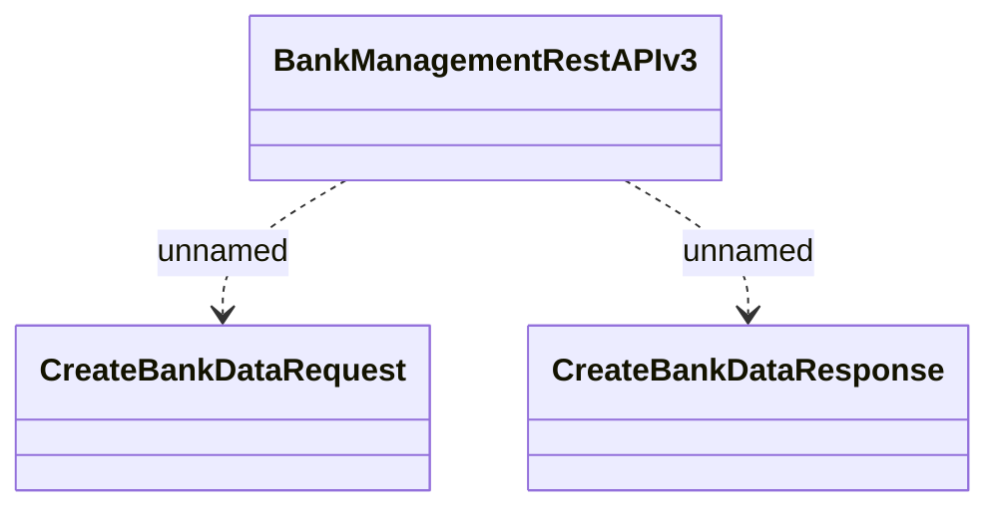

# BankManagementRestAPI - Create Bank Data

- **Diagram Type**: Logical
- **Package**: HomerSelect/BSL/Analysis Model/_Interface/Provided Web Services/Payments/BankManagementRestAPI
- **Diagram ID**: 162692
- **Elements**: 3
- **Connectors**: 2

