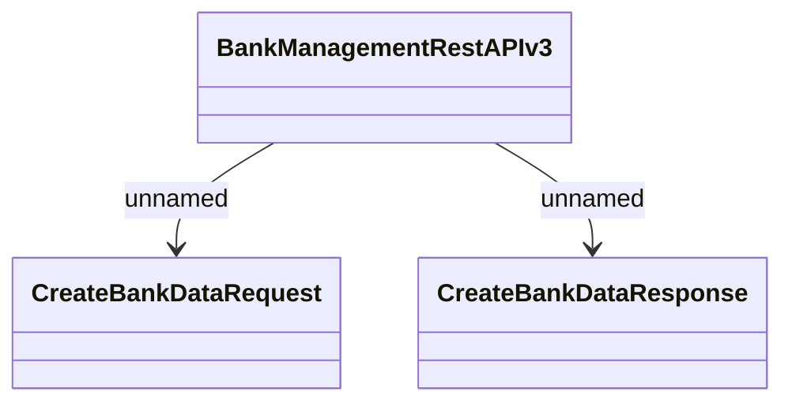

# BankManagementRestAPI - Create Bank Data

```mermaid
classDiagram
    class CreateBankDataResponse["CreateBankDataResponse"]
    class CreateBankDataRequest["CreateBankDataRequest"]
    class BankManagementRestAPIv3["BankManagementRestAPIv3"]
    BankManagementRestAPIv3 --> CreateBankDataRequest : unnamed
    BankManagementRestAPIv3 --> CreateBankDataResponse : unnamed
```
