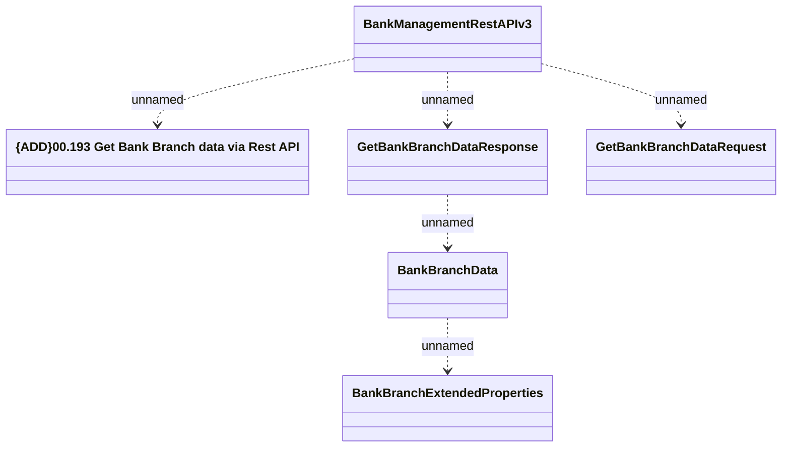

# BankManagementRestAPI - Get Bank Branch Data

- **Diagram Type**: Logical
- **Package**: HomerSelect/BSL/Analysis Model/_Interface/Provided Web Services/Payments/BankManagementRestAPI
- **Diagram ID**: 162690
- **Elements**: 6
- **Connectors**: 5

