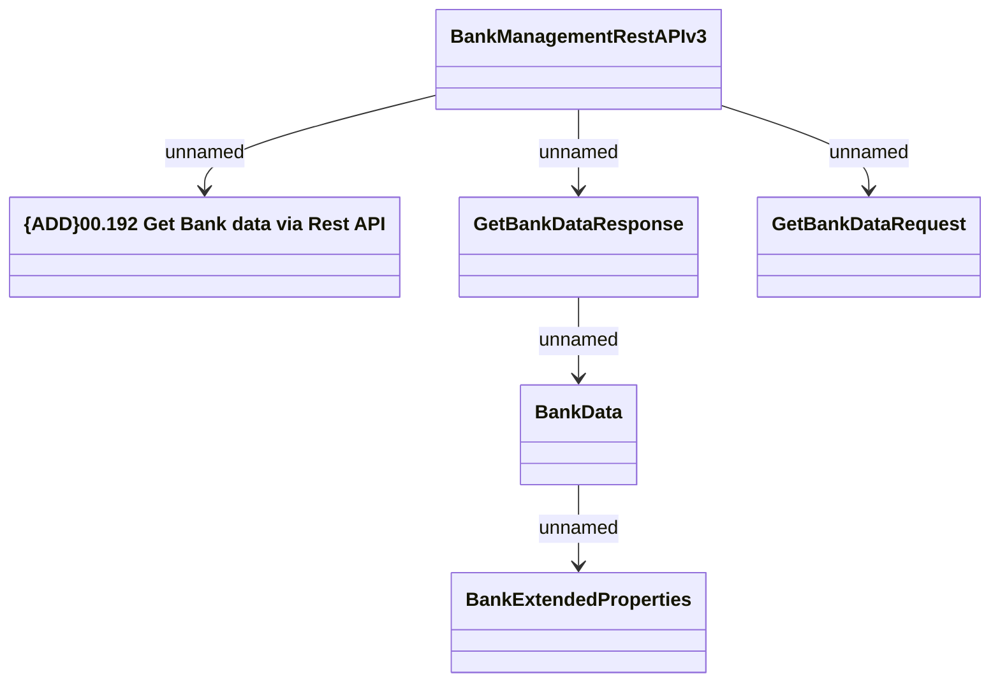

# BankManagementRestAPI - Get Bank Data

```mermaid
classDiagram
    class BankExtendedProperties["BankExtendedProperties"]
    class ADD_00_192_Get_Bank_data_via_Rest_API["{ADD}00.192 Get Bank data via Rest API"]
    class BankData["BankData"]
    class GetBankDataResponse["GetBankDataResponse"]
    class GetBankDataRequest["GetBankDataRequest"]
    class BankManagementRestAPIv3["BankManagementRestAPIv3"]
    BankManagementRestAPIv3 --> GetBankDataResponse : unnamed
    BankManagementRestAPIv3 --> GetBankDataRequest : unnamed
    BankManagementRestAPIv3 --> ADD_00_192_Get_Bank_data_via_Rest_API : unnamed
    GetBankDataResponse --> BankData : unnamed
    BankData --> BankExtendedProperties : unnamed
```
