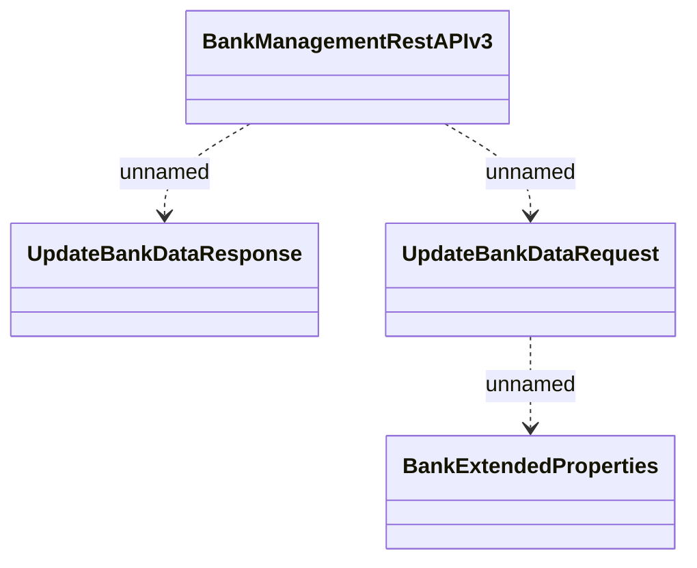

# BankManagementRestAPI - Update Bank Data

- **Diagram Type**: Logical
- **Package**: HomerSelect/BSL/Analysis Model/_Interface/Provided Web Services/Payments/BankManagementRestAPI
- **Diagram ID**: 162691
- **Elements**: 4
- **Connectors**: 3

