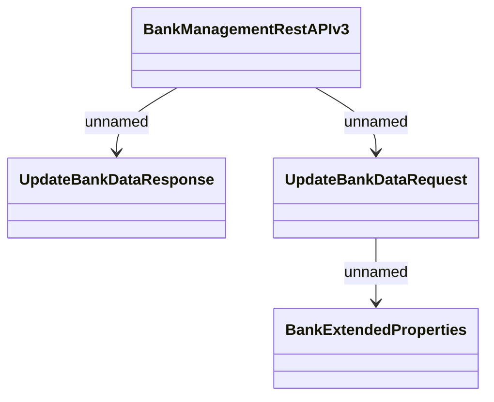

# BankManagementRestAPI - Update Bank Data

```mermaid
classDiagram
    class BankExtendedProperties["BankExtendedProperties"]
    class UpdateBankDataResponse["UpdateBankDataResponse"]
    class UpdateBankDataRequest["UpdateBankDataRequest"]
    class BankManagementRestAPIv3["BankManagementRestAPIv3"]
    BankManagementRestAPIv3 --> UpdateBankDataResponse : unnamed
    BankManagementRestAPIv3 --> UpdateBankDataRequest : unnamed
    UpdateBankDataRequest --> BankExtendedProperties : unnamed
```
