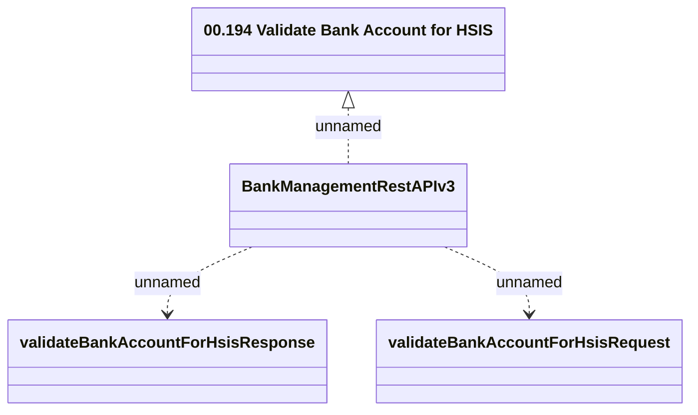

# BankManagementRestAPI - valiadteBankAccountForHsis

- **Diagram Type**: Logical
- **Package**: HomerSelect/BSL/Analysis Model/_Interface/Provided Web Services/Payments/BankManagementRestAPI
- **Diagram ID**: 162693
- **Elements**: 4
- **Connectors**: 3

