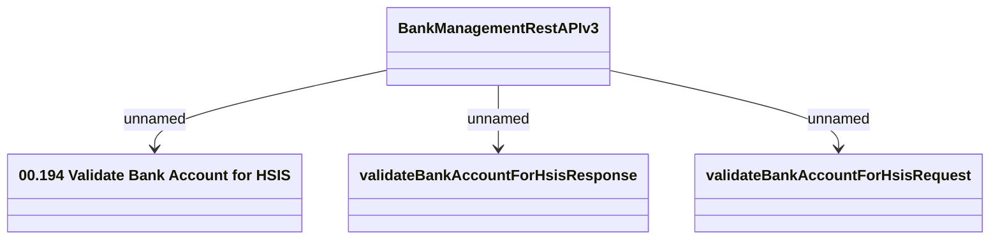

# BankManagementRestAPI - valiadteBankAccountForHsis

```mermaid
classDiagram
    class n_00_194_Validate_Bank_Account_for_HSIS["00.194 Validate Bank Account for HSIS"]
    class validateBankAccountForHsisResponse["validateBankAccountForHsisResponse"]
    class validateBankAccountForHsisRequest["validateBankAccountForHsisRequest"]
    class BankManagementRestAPIv3["BankManagementRestAPIv3"]
    BankManagementRestAPIv3 --> n_00_194_Validate_Bank_Account_for_HSIS : unnamed
    BankManagementRestAPIv3 --> validateBankAccountForHsisResponse : unnamed
    BankManagementRestAPIv3 --> validateBankAccountForHsisRequest : unnamed
```
