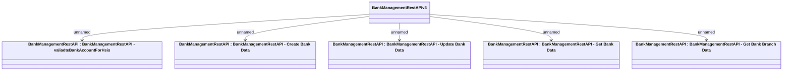

# BankManagementRestAPI

```mermaid
classDiagram
    class BankManagementRestAPI_BankManagementRestAPI_valiadteBankAcco["BankManagementRestAPI : BankManagementRestAPI - valiadteBankAccountForHsis"]
    class BankManagementRestAPI_BankManagementRestAPI_Update_Bank_Data["BankManagementRestAPI : BankManagementRestAPI - Update Bank Data"]
    class BankManagementRestAPI_BankManagementRestAPI_Create_Bank_Data["BankManagementRestAPI : BankManagementRestAPI - Create Bank Data"]
    class BankManagementRestAPIv3["BankManagementRestAPIv3"]
    class BankManagementRestAPI_BankManagementRestAPI_Get_Bank_Branch_["BankManagementRestAPI : BankManagementRestAPI - Get Bank Branch Data"]
    class BankManagementRestAPI_BankManagementRestAPI_Get_Bank_Data["BankManagementRestAPI : BankManagementRestAPI - Get Bank Data"]
    BankManagementRestAPIv3 --> BankManagementRestAPI_BankManagementRestAPI_valiadteBankAcco : unnamed
    BankManagementRestAPIv3 --> BankManagementRestAPI_BankManagementRestAPI_Create_Bank_Data : unnamed
    BankManagementRestAPIv3 --> BankManagementRestAPI_BankManagementRestAPI_Update_Bank_Data : unnamed
    BankManagementRestAPIv3 --> BankManagementRestAPI_BankManagementRestAPI_Get_Bank_Data : unnamed
    BankManagementRestAPIv3 --> BankManagementRestAPI_BankManagementRestAPI_Get_Bank_Branch_ : unnamed
```
