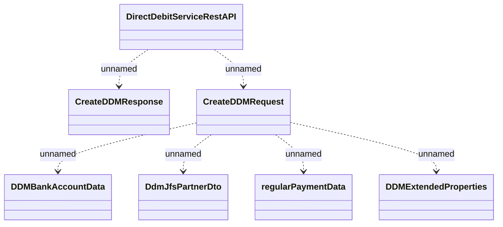

# DirectDebitServiceRestAPI - Create DDM

- **Diagram Type**: Logical
- **Package**: HomerSelect/BSL/Analysis Model/_Interface/Provided Web Services/Payments/DirectDebitMandateRest/DirectDebitMandateRestV1
- **Diagram ID**: 147105
- **Elements**: 7
- **Connectors**: 6

