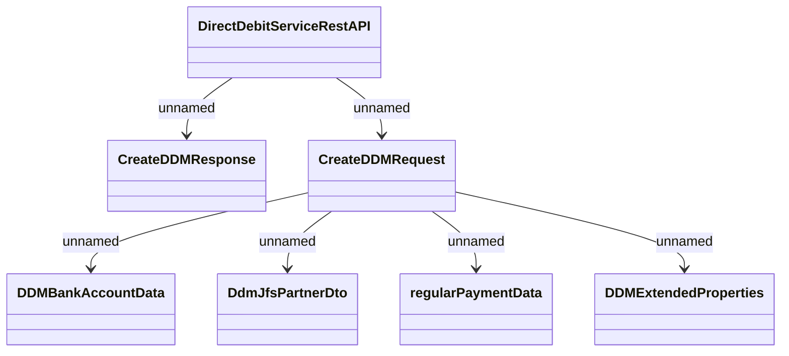

# DirectDebitServiceRestAPI - Create DDM

```mermaid
classDiagram
    class DDMExtendedProperties["DDMExtendedProperties"]
    class regularPaymentData["regularPaymentData"]
    class DdmJfsPartnerDto["DdmJfsPartnerDto"]
    class DDMBankAccountData["DDMBankAccountData"]
    class CreateDDMResponse["CreateDDMResponse"]
    class CreateDDMRequest["CreateDDMRequest"]
    class DirectDebitServiceRestAPI["DirectDebitServiceRestAPI"]
    DirectDebitServiceRestAPI --> CreateDDMRequest : unnamed
    DirectDebitServiceRestAPI --> CreateDDMResponse : unnamed
    CreateDDMRequest --> DDMBankAccountData : unnamed
    CreateDDMRequest --> DdmJfsPartnerDto : unnamed
    CreateDDMRequest --> regularPaymentData : unnamed
    CreateDDMRequest --> DDMExtendedProperties : unnamed
```
