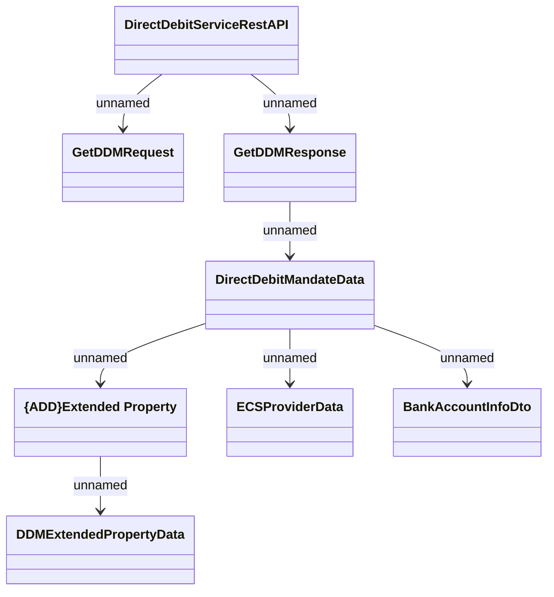

# DirectDebitServiceRestAPI - Get DDM

```mermaid
classDiagram
    class ADD_Extended_Property["{ADD}Extended Property"]
    class DDMExtendedPropertyData["DDMExtendedPropertyData"]
    class ECSProviderData["ECSProviderData"]
    class BankAccountInfoDto["BankAccountInfoDto"]
    class DirectDebitMandateData["DirectDebitMandateData"]
    class GetDDMRequest["GetDDMRequest"]
    class GetDDMResponse["GetDDMResponse"]
    class DirectDebitServiceRestAPI["DirectDebitServiceRestAPI"]
    DirectDebitServiceRestAPI --> GetDDMResponse : unnamed
    DirectDebitServiceRestAPI --> GetDDMRequest : unnamed
    GetDDMResponse --> DirectDebitMandateData : unnamed
    DirectDebitMandateData --> BankAccountInfoDto : unnamed
    DirectDebitMandateData --> ECSProviderData : unnamed
    ADD_Extended_Property --> DDMExtendedPropertyData : unnamed
    DirectDebitMandateData --> ADD_Extended_Property : unnamed
```
