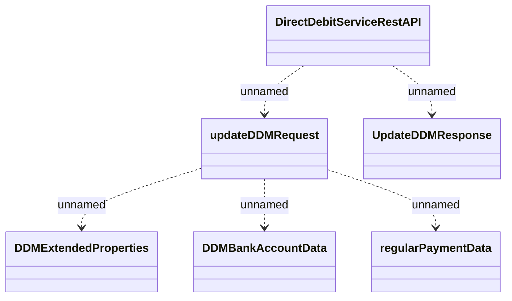

# DirectDebitServiceRestAPI - Update DDM

- **Diagram Type**: Logical
- **Package**: HomerSelect/BSL/Analysis Model/_Interface/Provided Web Services/Payments/DirectDebitMandateRest/DirectDebitMandateRestV1
- **Diagram ID**: 147106
- **Elements**: 6
- **Connectors**: 5

