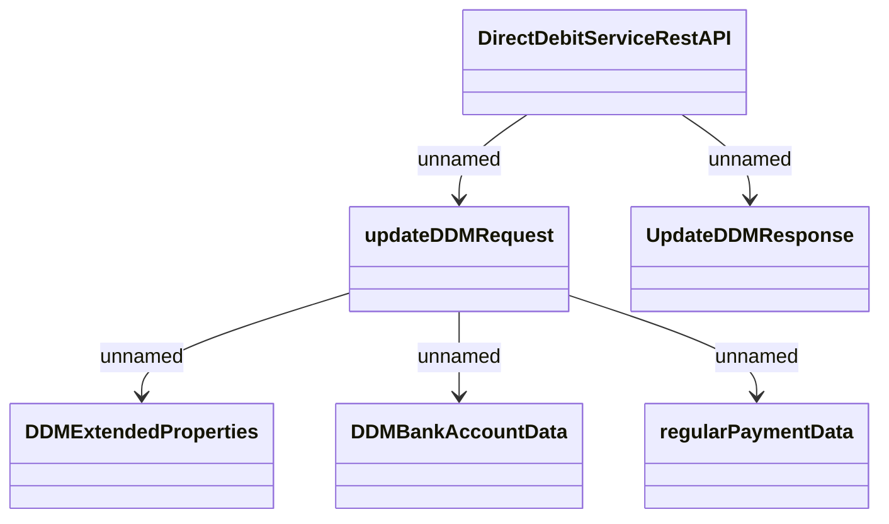

# DirectDebitServiceRestAPI - Update DDM

```mermaid
classDiagram
    class regularPaymentData["regularPaymentData"]
    class DDMBankAccountData["DDMBankAccountData"]
    class DDMExtendedProperties["DDMExtendedProperties"]
    class updateDDMRequest["updateDDMRequest"]
    class UpdateDDMResponse["UpdateDDMResponse"]
    class DirectDebitServiceRestAPI["DirectDebitServiceRestAPI"]
    DirectDebitServiceRestAPI --> UpdateDDMResponse : unnamed
    DirectDebitServiceRestAPI --> updateDDMRequest : unnamed
    updateDDMRequest --> DDMExtendedProperties : unnamed
    updateDDMRequest --> DDMBankAccountData : unnamed
    updateDDMRequest --> regularPaymentData : unnamed
```
