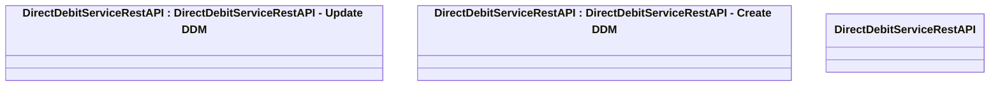

# DirectDebitServiceRestAPI

- **Diagram Type**: Logical
- **Package**: HomerSelect/BSL/Analysis Model/_Interface/Provided Web Services/Payments/DirectDebitMandateRest/DirectDebitMandateRestV1
- **Diagram ID**: 147104
- **Elements**: 4
- **Connectors**: 0

