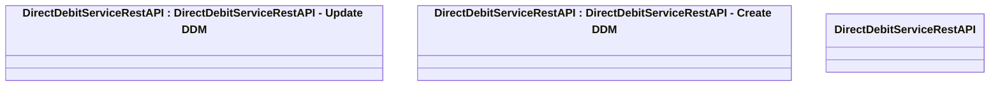

# DirectDebitServiceRestAPI

```mermaid
classDiagram
    class DirectDebitServiceRestAPI_DirectDebitServiceRestAPI_Update_D["DirectDebitServiceRestAPI : DirectDebitServiceRestAPI - Update DDM"]
    class DirectDebitServiceRestAPI_DirectDebitServiceRestAPI_Create_D["DirectDebitServiceRestAPI : DirectDebitServiceRestAPI - Create DDM Document"]
    class DirectDebitServiceRestAPI_DirectDebitServiceRestAPI_Create_D["DirectDebitServiceRestAPI : DirectDebitServiceRestAPI - Create DDM"]
    class DirectDebitServiceRestAPI["DirectDebitServiceRestAPI"]
```
