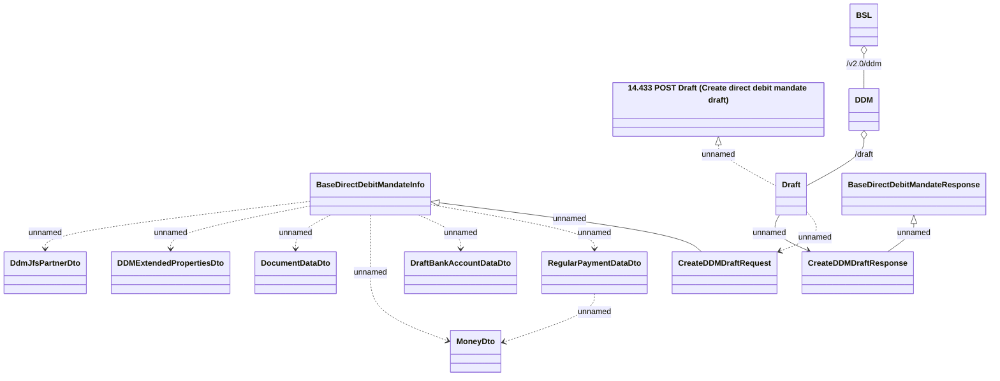

# DirectDebitMandateRestV2 - CreateDDMDraft

- **Diagram Type**: Logical
- **Package**: HomerSelect/BSL/Analysis Model/_Interface/Provided Web Services/Payments/DirectDebitMandateRest/DirectDebitMandateRestV2
- **Diagram ID**: 158061
- **Elements**: 14
- **Connectors**: 14

