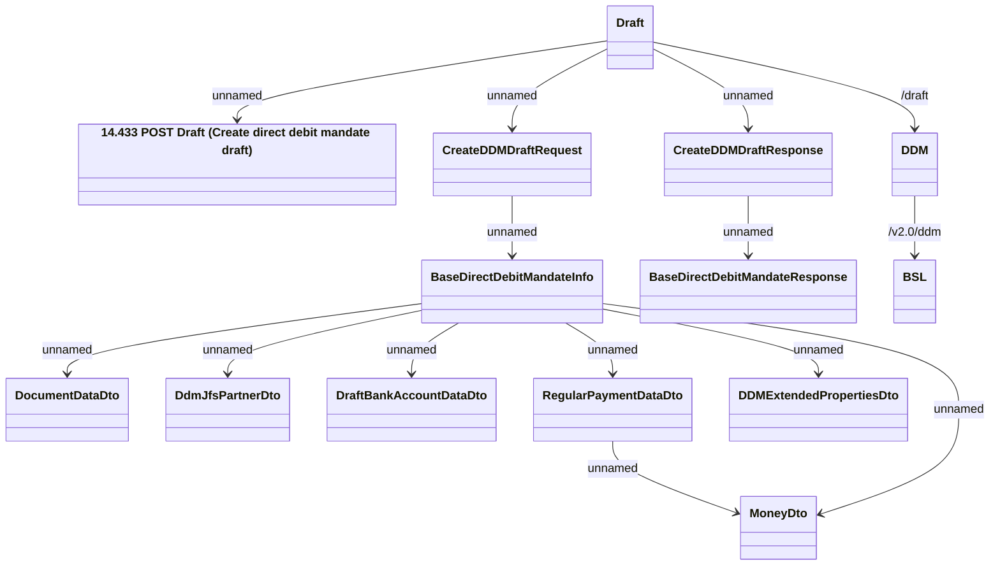

# DirectDebitMandateRestV2 - CreateDDMDraft

```mermaid
classDiagram
    class BaseDirectDebitMandateInfo["BaseDirectDebitMandateInfo"]
    class DocumentDataDto["DocumentDataDto"]
    class DdmJfsPartnerDto["DdmJfsPartnerDto"]
    class DraftBankAccountDataDto["DraftBankAccountDataDto"]
    class RegularPaymentDataDto["RegularPaymentDataDto"]
    class DDMExtendedPropertiesDto["DDMExtendedPropertiesDto"]
    class MoneyDto["MoneyDto"]
    class n_14_433_POST_Draft_Create_direct_debit_mandate_draft["14.433 POST Draft (Create direct debit mandate draft)"]
    class CreateDDMDraftRequest["CreateDDMDraftRequest"]
    class CreateDDMDraftResponse["CreateDDMDraftResponse"]
    class Draft["Draft"]
    class BaseDirectDebitMandateResponse["BaseDirectDebitMandateResponse"]
    class DDM["DDM"]
    class BSL["BSL"]
    DDM --> BSL : /v2.0/ddm
    Draft --> DDM : /draft
    Draft --> CreateDDMDraftRequest : unnamed
    Draft --> CreateDDMDraftResponse : unnamed
    Draft --> n_14_433_POST_Draft_Create_direct_debit_mandate_draft : unnamed
    CreateDDMDraftResponse --> BaseDirectDebitMandateResponse : unnamed
    CreateDDMDraftRequest --> BaseDirectDebitMandateInfo : unnamed
    RegularPaymentDataDto --> MoneyDto : unnamed
    BaseDirectDebitMandateInfo --> RegularPaymentDataDto : unnamed
    BaseDirectDebitMandateInfo --> DraftBankAccountDataDto : unnamed
    BaseDirectDebitMandateInfo --> MoneyDto : unnamed
    BaseDirectDebitMandateInfo --> DocumentDataDto : unnamed
    BaseDirectDebitMandateInfo --> DDMExtendedPropertiesDto : unnamed
    BaseDirectDebitMandateInfo --> DdmJfsPartnerDto : unnamed
```
