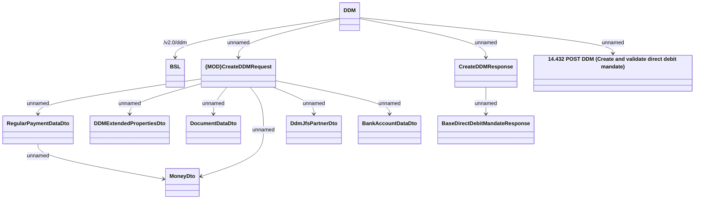

# DirectDebitMandateRestV2 - CreateDDM

```mermaid
classDiagram
    class DocumentDataDto["DocumentDataDto"]
    class n_14_432_POST_DDM_Create_and_validate_direct_debit_mandate["14.432 POST DDM (Create and validate direct debit mandate)"]
    class CreateDDMResponse["CreateDDMResponse"]
    class BankAccountDataDto["BankAccountDataDto"]
    class RegularPaymentDataDto["RegularPaymentDataDto"]
    class MOD_CreateDDMRequest["{MOD}CreateDDMRequest"]
    class DDMExtendedPropertiesDto["DDMExtendedPropertiesDto"]
    class MoneyDto["MoneyDto"]
    class DdmJfsPartnerDto["DdmJfsPartnerDto"]
    class BaseDirectDebitMandateResponse["BaseDirectDebitMandateResponse"]
    class DDM["DDM"]
    class BSL["BSL"]
    DDM --> BSL : /v2.0/ddm
    DDM --> MOD_CreateDDMRequest : unnamed
    DDM --> CreateDDMResponse : unnamed
    DDM --> n_14_432_POST_DDM_Create_and_validate_direct_debit_mandate : unnamed
    MOD_CreateDDMRequest --> RegularPaymentDataDto : unnamed
    MOD_CreateDDMRequest --> DDMExtendedPropertiesDto : unnamed
    MOD_CreateDDMRequest --> DocumentDataDto : unnamed
    MOD_CreateDDMRequest --> MoneyDto : unnamed
    MOD_CreateDDMRequest --> DdmJfsPartnerDto : unnamed
    MOD_CreateDDMRequest --> BankAccountDataDto : unnamed
    RegularPaymentDataDto --> MoneyDto : unnamed
    CreateDDMResponse --> BaseDirectDebitMandateResponse : unnamed
```
