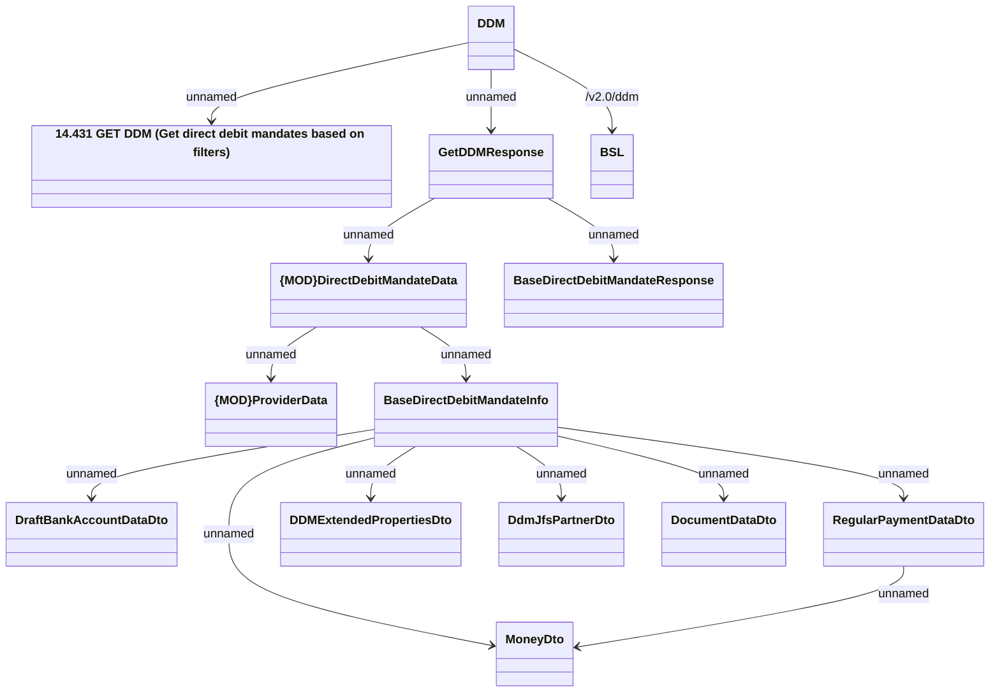

# DirectDebitMandateRestV2 - GetDDM

```mermaid
classDiagram
    class DraftBankAccountDataDto["DraftBankAccountDataDto"]
    class RegularPaymentDataDto["RegularPaymentDataDto"]
    class n_14_431_GET_DDM_Get_direct_debit_mandates_based_on_filters["14.431 GET DDM (Get direct debit mandates based on filters)"]
    class MOD_ProviderData["{MOD}ProviderData"]
    class DDMExtendedPropertiesDto["DDMExtendedPropertiesDto"]
    class MoneyDto["MoneyDto"]
    class DdmJfsPartnerDto["DdmJfsPartnerDto"]
    class DocumentDataDto["DocumentDataDto"]
    class MOD_DirectDebitMandateData["{MOD}DirectDebitMandateData"]
    class GetDDMResponse["GetDDMResponse"]
    class BaseDirectDebitMandateResponse["BaseDirectDebitMandateResponse"]
    class BaseDirectDebitMandateInfo["BaseDirectDebitMandateInfo"]
    class DDM["DDM"]
    class BSL["BSL"]
    DDM --> BSL : /v2.0/ddm
    DDM --> n_14_431_GET_DDM_Get_direct_debit_mandates_based_on_filters : unnamed
    DDM --> GetDDMResponse : unnamed
    BaseDirectDebitMandateInfo --> RegularPaymentDataDto : unnamed
    BaseDirectDebitMandateInfo --> DraftBankAccountDataDto : unnamed
    BaseDirectDebitMandateInfo --> MoneyDto : unnamed
    BaseDirectDebitMandateInfo --> DocumentDataDto : unnamed
    BaseDirectDebitMandateInfo --> DDMExtendedPropertiesDto : unnamed
    BaseDirectDebitMandateInfo --> DdmJfsPartnerDto : unnamed
    GetDDMResponse --> BaseDirectDebitMandateResponse : unnamed
    GetDDMResponse --> MOD_DirectDebitMandateData : unnamed
    MOD_DirectDebitMandateData --> BaseDirectDebitMandateInfo : unnamed
    MOD_DirectDebitMandateData --> MOD_ProviderData : unnamed
    RegularPaymentDataDto --> MoneyDto : unnamed
```
