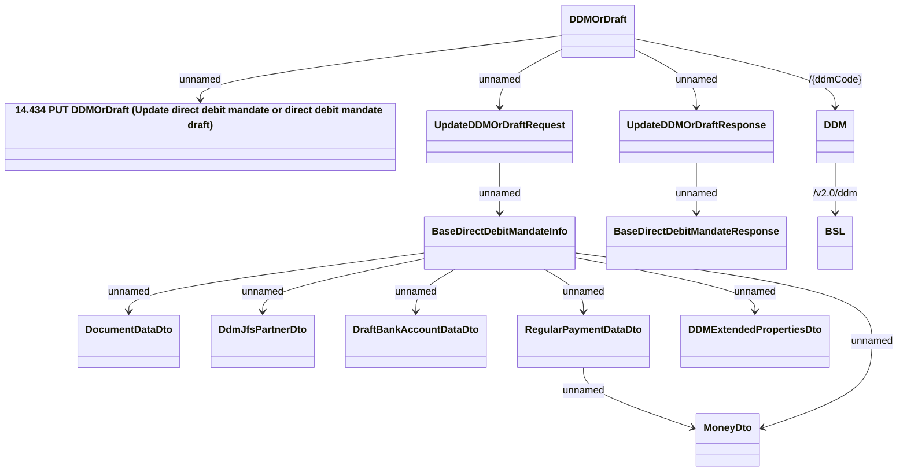

# DirectDebitMandateRestV2 - UpdateDDMOrDraft

```mermaid
classDiagram
    class BaseDirectDebitMandateInfo["BaseDirectDebitMandateInfo"]
    class n_14_434_PUT_DDMOrDraft_Update_direct_debit_mandate_or_direc["14.434 PUT DDMOrDraft (Update direct debit mandate or direct debit mandate draft)"]
    class DocumentDataDto["DocumentDataDto"]
    class DdmJfsPartnerDto["DdmJfsPartnerDto"]
    class UpdateDDMOrDraftResponse["UpdateDDMOrDraftResponse"]
    class UpdateDDMOrDraftRequest["UpdateDDMOrDraftRequest"]
    class DraftBankAccountDataDto["DraftBankAccountDataDto"]
    class DDMOrDraft["DDMOrDraft"]
    class RegularPaymentDataDto["RegularPaymentDataDto"]
    class DDMExtendedPropertiesDto["DDMExtendedPropertiesDto"]
    class MoneyDto["MoneyDto"]
    class BaseDirectDebitMandateResponse["BaseDirectDebitMandateResponse"]
    class DDM["DDM"]
    class BSL["BSL"]
    DDM --> BSL : /v2.0/ddm
    RegularPaymentDataDto --> MoneyDto : unnamed
    DDMOrDraft --> UpdateDDMOrDraftRequest : unnamed
    DDMOrDraft --> DDM : /{ddmCode}
    DDMOrDraft --> n_14_434_PUT_DDMOrDraft_Update_direct_debit_mandate_or_direc : unnamed
    DDMOrDraft --> UpdateDDMOrDraftResponse : unnamed
    UpdateDDMOrDraftRequest --> BaseDirectDebitMandateInfo : unnamed
    UpdateDDMOrDraftResponse --> BaseDirectDebitMandateResponse : unnamed
    BaseDirectDebitMandateInfo --> RegularPaymentDataDto : unnamed
    BaseDirectDebitMandateInfo --> DraftBankAccountDataDto : unnamed
    BaseDirectDebitMandateInfo --> MoneyDto : unnamed
    BaseDirectDebitMandateInfo --> DocumentDataDto : unnamed
    BaseDirectDebitMandateInfo --> DDMExtendedPropertiesDto : unnamed
    BaseDirectDebitMandateInfo --> DdmJfsPartnerDto : unnamed
```
