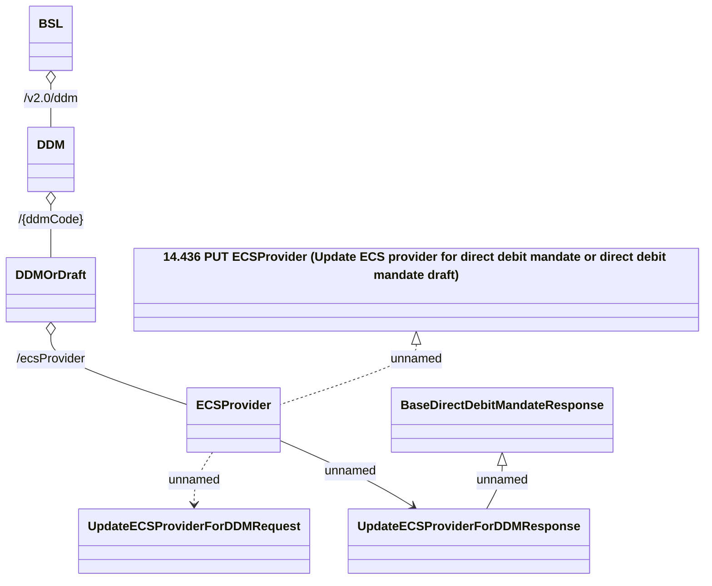

# DirectDebitMandateRestV2 - UpdateECSProvider

- **Diagram Type**: Logical
- **Package**: HomerSelect/BSL/Analysis Model/_Interface/Provided Web Services/Payments/DirectDebitMandateRest/DirectDebitMandateRestV2
- **Diagram ID**: 158064
- **Elements**: 8
- **Connectors**: 7

