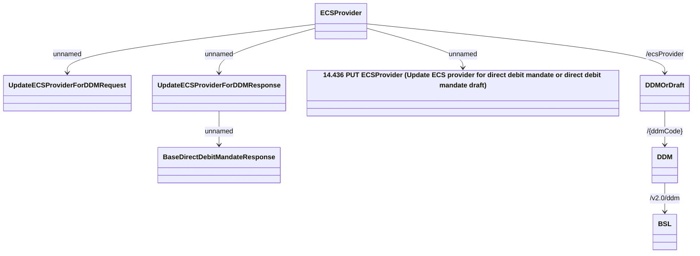

# DirectDebitMandateRestV2 - UpdateECSProvider

```mermaid
classDiagram
    class UpdateECSProviderForDDMRequest["UpdateECSProviderForDDMRequest"]
    class UpdateECSProviderForDDMResponse["UpdateECSProviderForDDMResponse"]
    class n_14_436_PUT_ECSProvider_Update_ECS_provider_for_direct_debi["14.436 PUT ECSProvider (Update ECS provider for direct debit mandate or direct debit mandate draft)"]
    class ECSProvider["ECSProvider"]
    class BaseDirectDebitMandateResponse["BaseDirectDebitMandateResponse"]
    class DDM["DDM"]
    class BSL["BSL"]
    class DDMOrDraft["DDMOrDraft"]
    DDMOrDraft --> DDM : /{ddmCode}
    DDM --> BSL : /v2.0/ddm
    ECSProvider --> UpdateECSProviderForDDMRequest : unnamed
    ECSProvider --> UpdateECSProviderForDDMResponse : unnamed
    ECSProvider --> DDMOrDraft : /ecsProvider
    ECSProvider --> n_14_436_PUT_ECSProvider_Update_ECS_provider_for_direct_debi : unnamed
    UpdateECSProviderForDDMResponse --> BaseDirectDebitMandateResponse : unnamed
```
