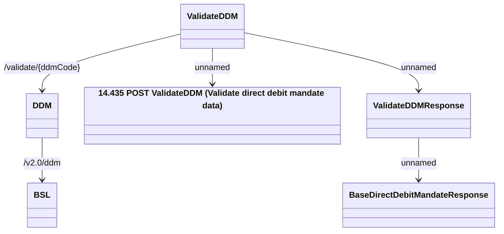

# DirectDebitMandateRestV2 - ValidateDDM

```mermaid
classDiagram
    class BaseDirectDebitMandateResponse["BaseDirectDebitMandateResponse"]
    class ValidateDDMResponse["ValidateDDMResponse"]
    class ValidateDDM["ValidateDDM"]
    class n_14_435_POST_ValidateDDM_Validate_direct_debit_mandate_data["14.435 POST ValidateDDM (Validate direct debit mandate data)"]
    class DDM["DDM"]
    class BSL["BSL"]
    DDM --> BSL : /v2.0/ddm
    ValidateDDM --> n_14_435_POST_ValidateDDM_Validate_direct_debit_mandate_data : unnamed
    ValidateDDM --> DDM : /validate/{ddmCode}
    ValidateDDM --> ValidateDDMResponse : unnamed
    ValidateDDMResponse --> BaseDirectDebitMandateResponse : unnamed
```
