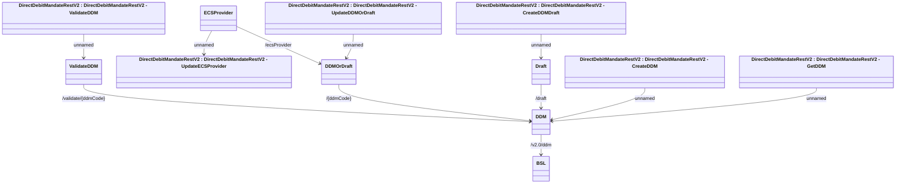

# DirectDebitMandateRestV2

```mermaid
classDiagram
    class DirectDebitMandateRestV2_DirectDebitMandateRestV2_UpdateECSP["DirectDebitMandateRestV2 : DirectDebitMandateRestV2 - UpdateECSProvider"]
    class ECSProvider["ECSProvider"]
    class DirectDebitMandateRestV2_DirectDebitMandateRestV2_UpdateDDMO["DirectDebitMandateRestV2 : DirectDebitMandateRestV2 - UpdateDDMOrDraft"]
    class DirectDebitMandateRestV2_DirectDebitMandateRestV2_ValidateDD["DirectDebitMandateRestV2 : DirectDebitMandateRestV2 - ValidateDDM"]
    class ValidateDDM["ValidateDDM"]
    class DDMOrDraft["DDMOrDraft"]
    class Draft["Draft"]
    class DirectDebitMandateRestV2_DirectDebitMandateRestV2_CreateDDMD["DirectDebitMandateRestV2 : DirectDebitMandateRestV2 - CreateDDMDraft"]
    class DirectDebitMandateRestV2_DirectDebitMandateRestV2_CreateDDM["DirectDebitMandateRestV2 : DirectDebitMandateRestV2 - CreateDDM"]
    class DirectDebitMandateRestV2_DirectDebitMandateRestV2_GetDDM["DirectDebitMandateRestV2 : DirectDebitMandateRestV2 - GetDDM"]
    class DDM["DDM"]
    class BSL["BSL"]
    DDM --> BSL : /v2.0/ddm
    DirectDebitMandateRestV2_DirectDebitMandateRestV2_GetDDM --> DDM : unnamed
    DirectDebitMandateRestV2_DirectDebitMandateRestV2_CreateDDM --> DDM : unnamed
    DirectDebitMandateRestV2_DirectDebitMandateRestV2_CreateDDMD --> Draft : unnamed
    Draft --> DDM : /draft
    DDMOrDraft --> DDM : /{ddmCode}
    ValidateDDM --> DDM : /validate/{ddmCode}
    DirectDebitMandateRestV2_DirectDebitMandateRestV2_ValidateDD --> ValidateDDM : unnamed
    DirectDebitMandateRestV2_DirectDebitMandateRestV2_UpdateDDMO --> DDMOrDraft : unnamed
    ECSProvider --> DDMOrDraft : /ecsProvider
    ECSProvider --> DirectDebitMandateRestV2_DirectDebitMandateRestV2_UpdateECSP : unnamed
```
