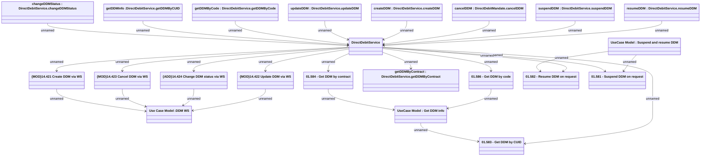

# DirectDebitService

```mermaid
classDiagram
    class ADD_14_424_Change_DDM_status_via_WS["{ADD}14.424 Change DDM status via WS"]
    class changeDDMStatus_DirectDebitService_changeDDMStatus["changeDDMStatus : DirectDebitService.changeDDMStatus"]
    class getDDMInfo_DirectDebitService_getDDMByCUID["getDDMInfo :DirectDebitService.getDDMByCUID"]
    class Use_Case_Model_DDM_WS["Use Case Model : DDM WS"]
    class Use_Case_Model_DDM_WS["Use Case Model :DDM WS"]
    class getDDMByCode_DirectDebitService_getDDMByCode["getDDMByCode : DirectDebitService.getDDMByCode"]
    class n_01_586_Get_DDM_by_code["01.586 - Get DDM by code"]
    class MOD_14_423_Cancel_DDM_via_WS["{MOD}14.423 Cancel DDM via WS"]
    class MOD_14_421_Create_DDM_via_WS["{MOD}14.421 Create DDM via WS"]
    class MOD_14_422_Update_DDM_via_WS["{MOD}14.422 Update DDM via WS"]
    class updateDDM_DirectDebitService_updateDDM["updateDDM : DirectDebitService.updateDDM"]
    class createDDM_DirectDebitService_createDDM["createDDM : DirectDebitService.createDDM"]
    class cancelDDM_DirectDebitMandate_cancelDDM["cancelDDM : DirectDebitMandate.cancelDDM"]
    class suspendDDM_DirectDebitService_suspendDDM["suspendDDM : DirectDebitService.suspendDDM"]
    class resumeDDM_DirectDebitService_resumeDDM["resumeDDM : DirectDebitService.resumeDDM"]
    class getDDMByContract_DirectDebitService_getDDMByContract["getDDMByContract : DirectDebitService.getDDMByContract"]
    class n_01_584_Get_DDM_by_contract["01.584 - Get DDM by contract"]
    class UseCase_Model_Get_DDM_info["UseCase Model : Get DDM info"]
    class n_01_583_Get_DDM_by_CUID["01.583 - Get DDM by CUID"]
    class n_01_582_Resume_DDM_on_request["01.582 - Resume DDM on request"]
    class n_01_581_Suspend_DDM_on_request["01.581 - Suspend DDM on request"]
    class UseCase_Model_Suspend_and_resume_DDM["UseCase Model : Suspend and resume DDM"]
    class DirectDebitService["DirectDebitService"]
    UseCase_Model_Get_DDM_info --> n_01_583_Get_DDM_by_CUID : unnamed
    changeDDMStatus_DirectDebitService_changeDDMStatus --> DirectDebitService : unnamed
    getDDMInfo_DirectDebitService_getDDMByCUID --> DirectDebitService : unnamed
    getDDMByCode_DirectDebitService_getDDMByCode --> DirectDebitService : unnamed
    updateDDM_DirectDebitService_updateDDM --> DirectDebitService : unnamed
    createDDM_DirectDebitService_createDDM --> DirectDebitService : unnamed
    cancelDDM_DirectDebitMandate_cancelDDM --> DirectDebitService : unnamed
    suspendDDM_DirectDebitService_suspendDDM --> DirectDebitService : unnamed
    DirectDebitService --> n_01_581_Suspend_DDM_on_request : unnamed
    UseCase_Model_Suspend_and_resume_DDM --> n_01_582_Resume_DDM_on_request : unnamed
    UseCase_Model_Suspend_and_resume_DDM --> n_01_581_Suspend_DDM_on_request : unnamed
    DirectDebitService --> getDDMByContract_DirectDebitService_getDDMByContract : unnamed
    DirectDebitService --> n_01_586_Get_DDM_by_code : unnamed
    DirectDebitService --> n_01_584_Get_DDM_by_contract : unnamed
    DirectDebitService --> MOD_14_421_Create_DDM_via_WS : unnamed
    DirectDebitService --> ADD_14_424_Change_DDM_status_via_WS : unnamed
    DirectDebitService --> n_01_583_Get_DDM_by_CUID : unnamed
    DirectDebitService --> n_01_582_Resume_DDM_on_request : unnamed
    DirectDebitService --> MOD_14_423_Cancel_DDM_via_WS : unnamed
    DirectDebitService --> MOD_14_422_Update_DDM_via_WS : unnamed
    resumeDDM_DirectDebitService_resumeDDM --> DirectDebitService : unnamed
    MOD_14_421_Create_DDM_via_WS --> Use_Case_Model_DDM_WS : unnamed
    MOD_14_423_Cancel_DDM_via_WS --> Use_Case_Model_DDM_WS : unnamed
    ADD_14_424_Change_DDM_status_via_WS --> Use_Case_Model_DDM_WS : unnamed
    n_01_584_Get_DDM_by_contract --> UseCase_Model_Get_DDM_info : unnamed
    n_01_586_Get_DDM_by_code --> UseCase_Model_Get_DDM_info : unnamed
    MOD_14_422_Update_DDM_via_WS --> Use_Case_Model_DDM_WS : unnamed
```
