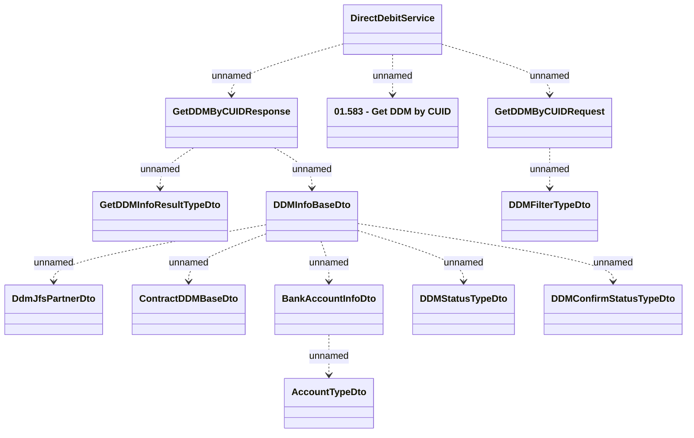

# DirectDebitServiceV5 - Get DDM by CUID

- **Diagram Type**: Logical
- **Package**: HomerSelect/BSL/Analysis Model/_Interface/Provided Web Services/Payments/DirectDebitService/DirectDebitServiceV5
- **Diagram ID**: 147082
- **Elements**: 13
- **Connectors**: 12

