# DirectDebitServiceV5

- **Diagram Type**: Logical
- **Package**: HomerSelect/BSL/Analysis Model/_Interface/Provided Web Services/Payments/DirectDebitService/DirectDebitServiceV5
- **Diagram ID**: 147078
- **Elements**: 5
- **Connectors**: 0

```mermaid
classDiagram
    class DirectDebitServiceV5_DirectDebitServiceV5_Get_DDM_by_contrac["DirectDebitServiceV5 : DirectDebitServiceV5 - Get DDM by contract"]
    class DirectDebitServiceV5_DirectDebitServiceV5_Update_DDM["DirectDebitServiceV5 : DirectDebitServiceV5 - Update DDM"]
    class DirectDebitServiceV5_DirectDebitServiceV5_Get_DDM_by_CUID["DirectDebitServiceV5 : DirectDebitServiceV5 - Get DDM by CUID"]
    class DirectDebitServiceV5_DirectDebitServiceV5_Create_DDM["DirectDebitServiceV5 : DirectDebitServiceV5 - Create DDM"]
    class DirectDebitService["DirectDebitService"]
```

