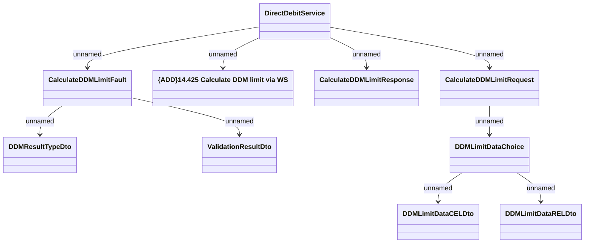

# DirectDebitService.calculateDDMLimit

```mermaid
classDiagram
    class DDMResultTypeDto["DDMResultTypeDto"]
    class ValidationResultDto["ValidationResultDto"]
    class CalculateDDMLimitFault["CalculateDDMLimitFault"]
    class ADD_14_425_Calculate_DDM_limit_via_WS["{ADD}14.425 Calculate DDM limit via WS"]
    class DDMLimitDataCELDto["DDMLimitDataCELDto"]
    class DDMLimitDataRELDto["DDMLimitDataRELDto"]
    class DDMLimitDataChoice["DDMLimitDataChoice"]
    class DirectDebitService["DirectDebitService"]
    class CalculateDDMLimitResponse["CalculateDDMLimitResponse"]
    class CalculateDDMLimitRequest["CalculateDDMLimitRequest"]
    CalculateDDMLimitRequest --> DDMLimitDataChoice : unnamed
    CalculateDDMLimitFault --> ValidationResultDto : unnamed
    CalculateDDMLimitFault --> DDMResultTypeDto : unnamed
    DirectDebitService --> CalculateDDMLimitFault : unnamed
    DirectDebitService --> ADD_14_425_Calculate_DDM_limit_via_WS : unnamed
    DirectDebitService --> CalculateDDMLimitResponse : unnamed
    DirectDebitService --> CalculateDDMLimitRequest : unnamed
    DDMLimitDataChoice --> DDMLimitDataCELDto : unnamed
    DDMLimitDataChoice --> DDMLimitDataRELDto : unnamed
```
